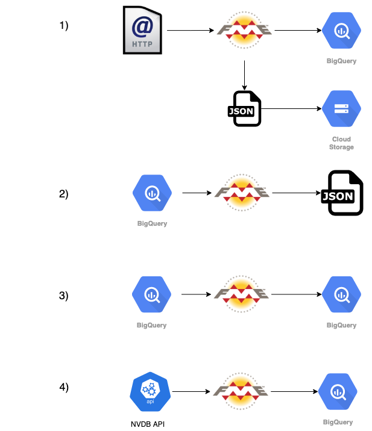

# Oversikt sesjon 2 - ETL med FME og Google Cloud

## Generelt
I denne sesjonen skal vi øve oss på kobling mellom FME og BigQuery/Google cloud storage og lage noen enkle ETL workflows. 
- For å gjøre det enkelt å komme i gang inneholder alle oppgavene en fasit. 
- Gjerne prøv å lage en løsning fra scratch dersom du er allerede kjent med FME!
- I hvert fall kreves det endringer i noen brukerparameter (som f.eks. autentisering mot Google Cloud, navn til BigQuery datasett, etc.)
- Oppgave 1) og 2) dekker oppsett av grunnlegende workflows som skriving og lesing fra BigQuery og Google Cloud Storage.
- Gjerne se også på eksempler 3) og 4) som viser noen kompleksere workflows

Workflow (.fmw) og template filene (.fmwt) i denne mappen kan åpnes med FME workbench.

Dersom filene åpnes med en egen FME installasjon/trial versjon utenfor ArcGIS interoperability extension kreves det ev. en endring på python interpreter compatibility til en python versjon som følger med standard FME:

`Workspace Parameters -> Scripting -> Python Compatibility -> Edit Parameter value`

## 1) bq_write_oppgave.fmwt
- ingest av en GeoJSON fil som inneholder kommunegeografier, publisert av [kartverket.no](https://github.com/smistad/konverter-norgeskart-projeksjon/releases/)
- opplasting til GCS bøtte ved bruk av FME's GoogleCloudStorageConnector 
- opplasting til BigQuery ved bruk av FME's GoogleBigQueryWriter 

## 2) bq_read_oppgave.fmwt
- Kjør en BigQuery spørring ved bruk av FME's GoogleBigQueryConnector
- Lagring av resultatene til en lokal fil

## 3) bq_readwrite_oppgave.fmwt
- Kjør en BigQuery spørring (aggregasjon) ved bruk av FME's GoogleBigQueryConnector
- Pivot Transformasjon av resultatene gjennom FME's AttributePivoter
- Lagring av transformerte resultatene til en BigQuery tabell (GoogleBigQueryWriter)

## 4) NVDBapi_kommune.fmwt
- Henting av kommunegeografier fra NVDB API (HTTPCaller)
- Diverse formaterings- og ekstraksjonssteg
- Opplasting til BigQuery gjennom GoogleBigQueryWriter
